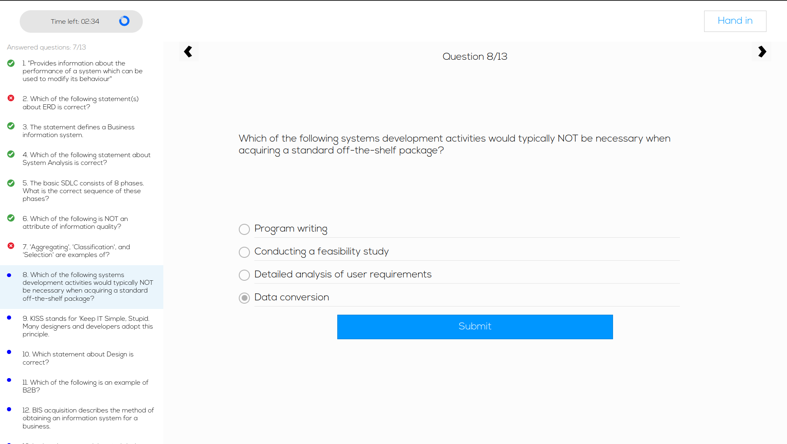

# Examination Website

Welcome to the Examination Website, a simple one-page web application to test your knowledge and explore web development basics. This project primarily utilizes JavaScript to create engaging online examinations.

## Table of Contents

- [Features](#features)
- [Getting Started](#getting-started)
- [How to Use](#how-to-use)
- [Results](#results)
- [Live Demo](#live-demo)
- [Local Setup](#local-setup)

## Features

- **Casual Test:** Contains fun questions with images and audio for entertainment.
- **Real Test:** A more serious exam with 13 questions to be answered within 3 minutes.

## How to Start

1. Choose between the casual or real test.
2. For each question, you can:
   - Answer the question.
   - Observe the submit button animation.
   - Check the correctness of your answer visually (red for wrong, green for correct).
   - Use the sidebar on the left to navigate through questions.
3. You can also go back and forth during the test.

## How to See Results

To view your results, you have three options:

1. Wait until the timer ends. A pop-up message will display your results automatically.
2. Answer all questions, and the results will be shown automatically.
3. Click the "Hand in" button in the header to finish the test before the time ends. Confirm your submission, and your score will be calculated.

## Project Showcase

To see the project in action, you can access the live version hosted on GitHub Pages: [Examination Website](https://sviatoslav-zubrytskyi.github.io/examination-website/exam_form.html){:target="_blank"}.

## Local Setup

To run this project locally, follow these steps:

1. Clone this repository to your local machine.
2. Open the `exam_form.html` file in a web browser.

Enjoy exploring the examination website!

---

Feel free to customize this README further with additional information or formatting as needed for your repository.
